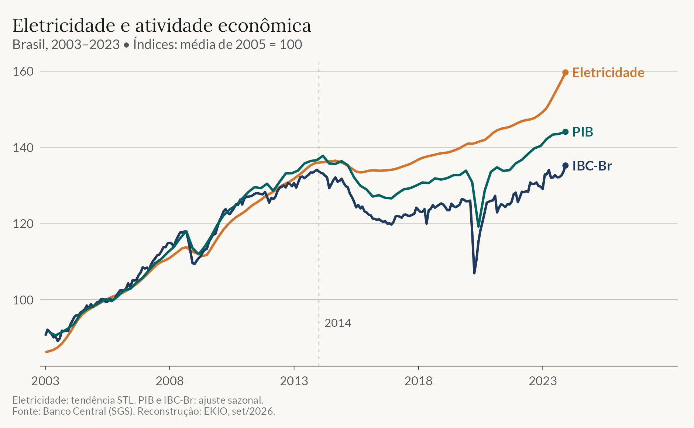

:::: {.data-story}
::: {.data-story-header}

[Economia em um gráfico]{.data-story-format}

# O consumo de energia se descolou do PIB {.data-story-title}

[Análise de fevereiro de 2024. Gráfico reconstruído em setembro de 2026.]{.data-story-date}

:::

::: {.data-story-chart}
{fig-alt="Gráfico de linhas do Brasil entre 2003 e 2023, com média de 2005 igual a 100. As três séries seguem trajetórias próximas até 2014. Depois, a tendência do consumo de eletricidade cresce mais que o PIB e o IBC-Br dessazonalizados. No fim do período, os índices estão próximos de 160, 144 e 135, respectivamente." width="100%"}

:::

::: {.data-story-copy}

O consumo de eletricidade costuma acompanhar a atividade econômica: produzir, vender e consumir demanda energia. Mas essa relação pode mudar ao longo do tempo.

**Depois de 2014, as trajetórias se afastaram no Brasil.** O consumo de eletricidade retomou o crescimento, enquanto o PIB e o IBC-Br, indicador mensal de atividade do Banco Central, passaram mais tempo estagnados. Até o final de 2023, a distância entre as curvas permanecia visível.

A comparação mostra por que o consumo de energia, isoladamente, pode dar uma leitura incompleta do ritmo da economia. O gráfico não identifica a causa desse descolamento: mudanças na composição da produção, no consumo residencial ou na eficiência energética exigiriam análises adicionais.

Como ler o gráfico e de onde vêm os dados

As séries têm bases próprias normalizadas: **100 corresponde à média de 2005** em cada uma delas. As linhas comparam crescimento relativo, não quantidades de energia e produto.

O PIB é trimestral e o IBC-Br é mensal; ambos têm ajuste sazonal. Para a eletricidade, a linha mostra a tendência extraída por decomposição STL do logaritmo da série mensal, reconvertida à escala original. A extração usa dados desde 2002; o gráfico começa em 2003. O PIB aparece no último mês de cada trimestre. Como os tratamentos diferem, a comparação destaca trajetórias de médio prazo.

Fonte: Banco Central do Brasil, Sistema Gerenciador de Séries Temporais (SGS), séries **1406** (consumo de energia elétrica), **24364** (IBC-Br dessazonalizado) e **22109** (PIB trimestral dessazonalizado). Esta reconstrução usa observações até dezembro de 2023 para manter um período final comum às três séries.

Os dados foram consultados novamente em 7 de setembro de 2026 e podem incorporar revisões posteriores à análise original. O período analisado permanece histórico. A tendência STL também pode mudar quando novas observações são incorporadas.

[Baixar os dados do gráfico](series-chart.csv) · [Dados de origem](series-source.csv) · [Código R da reconstrução](_build-chart.R)

[Ver a análise original e o código](https://restateinsight.com/posts/general-posts/2024-02-wz-energy/){.data-story-related}

[Análise de Vinicius Oike Reginatto]{.data-story-author}

:::
::::
