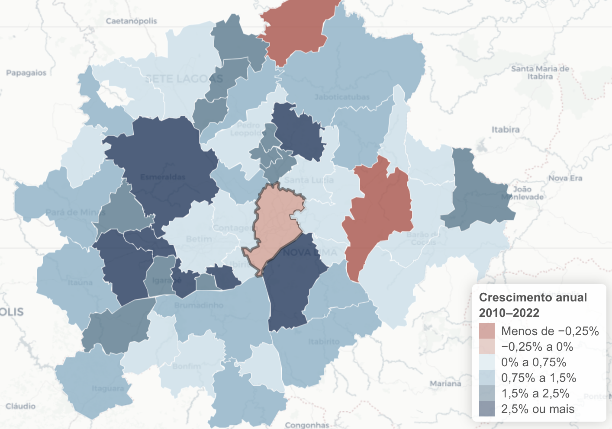

<!-- ============ Hero ============ -->
::: {.home-cover .column-screen}
```{=html}

```

::: {.home-cover-content}
::: {.home-cover-label}
Consultoria em Economia e Dados
:::

# Economia e dados aplicados a mercados, cidades e real estate. {.home-cover-title}

[Conheça nossos serviços](servicos.qmd){.home-cover-link}
:::
:::

::: {.home-intro}
Atendemos empresas e entidades governamentais em questões de mercado, investimento e localização.

[Fale conosco](mailto:contato@ekio.io?subject=Consulta%20inicial%20-%20EKIO){.link-rule}
:::

<!-- ============ O que fazemos ============ -->
::: {.band .band-light #services}
::: {.container}

::: {.section-head-row}
## O que fazemos {.section-heading}

[Ver todos os serviços](servicos.qmd){.link-rule-sm}
:::

<!-- Mesma ordem das ofertas em servicos.qmd. -->
::: {.services-grid .services-grid-2}

::: {.service-card}
[01]{.service-num}

### Estudos de mercado e viabilidade imobiliária {.service-title}

[Demanda, concorrência, preços e absorção antes de aprovar um lançamento.]{.service-desc}

[Saiba mais](servicos.qmd#viabilidade){.service-link}
:::

::: {.service-card}
[02]{.service-num}

### Estratégia de expansão e inteligência locacional {.service-title}

[Priorização de cidades, mercados e localidades.]{.service-desc}

[Saiba mais](servicos.qmd#expansao){.service-link}
:::

::: {.service-card}
[03]{.service-num}

### Produtos de dados sob medida {.service-title}

[Dashboards, índices e monitoramento feitos para rotinas de decisão.]{.service-desc}

[Saiba mais](servicos.qmd#produtos-de-dados){.service-link}
:::

::: {.service-card}
[04]{.service-num}

### Estudos econômicos e desenvolvimento urbano {.service-title}

[Efeitos econômicos e urbanos de políticas, projetos e investimentos.]{.service-desc}

[Saiba mais](servicos.qmd#desenvolvimento-urbano){.service-link}
:::

:::
:::
:::

<!-- ============ Insight em destaque ============ -->
<!-- Oculto até existir um relatório para destacar. Para exibir, apague estas
duas linhas e o fechamento do comentário no fim da seção.
::: {.band .band-dark .band-featured}
::: {.container}
::: {.featured-insight}

::: {.featured-chart}
{fig-alt="Mapa dos municípios da Região Metropolitana de Belo Horizonte e de seu colar metropolitano, coloridos pela taxa anual de crescimento populacional entre 2010 e 2022."}
:::

::: {.featured-text}

[Insight em destaque]{.section-label .section-label-light}

## O crescimento das regiões metropolitanas brasileiras {.section-heading .section-heading-light}

[Entre 2010 e 2022, grandes metrópoles perderam população ou cresceram pouco, enquanto as cidades médias absorveram o crescimento. É a mesma leitura demográfica que aplicamos em dimensionamento de mercado e seleção de pontos.]{.featured-desc}

[Ler a análise completa](insights/posts/2025-06-censo-metro-regions/index.qmd){.link-rule-light}

:::

:::
:::
:::
-->

<!-- ============ Insights ============ -->
::: {.band .band-light}
::: {.container}

::: {.section-head-row}
## Insights {.section-heading}

[Ver todos os insights](insights/index.qmd){.link-rule-sm}
:::

::: {#home-insights}
:::

:::
:::

<!-- ============ CTA ============ -->
::: {.band .band-cta .band-cta-art style="background-image: url(/static/images/art/hokusai-series-2026-09/hero-metropolitan-geometry.webp);"}
::: {.container}
::: {.cta-row}

::: {.cta-text}
## Comece por uma conversa {.cta-heading}

[Entrar em um novo mercado, avaliar um investimento ou montar uma estratégia de dados. Conte o seu caso e desenhamos a abordagem.]{.cta-desc}
:::

::: {.cta-actions}
[contato@ekio.io](mailto:contato@ekio.io?subject=Consulta%20inicial%20-%20EKIO){.link-rule-light}
[Formulário de contato](contato.qmd){.link-rule-light}
:::

:::
:::
:::
