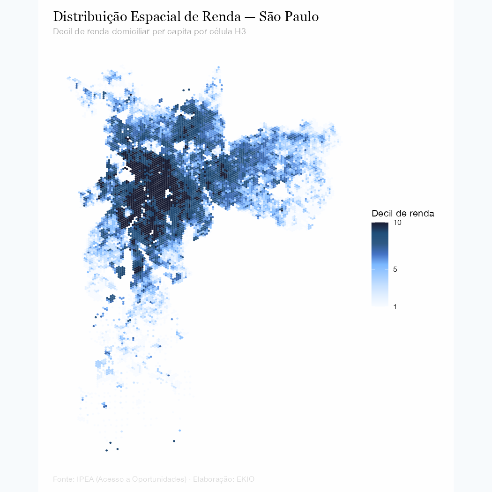

<!-- ============ Hero ============ -->
::: {.hero}
::: {.hero-inner}

::: {.hero-head}
[Consultoria Econômica · Ciência de Dados · Inteligência Espacial]{.hero-label}

# Insights econômicos orientados por dados para decisões mais inteligentes {.hero-title}
:::

::: {.hero-foot}

::: {.hero-copy}
[A EKIO combina análise econômica rigorosa, ciência de dados avançada e inteligência espacial para ajudar empresas e governos brasileiros a tomar decisões melhores.]{.hero-subtitle}

:::

::: {.hero-actions}
[Fale conosco](mailto:contact@ekio.io?subject=Consulta%20inicial%20-%20EKIO){.link-rule}
[Conheça os serviços](servicos.qmd){.link-rule-sm}
:::

:::

:::

:::

<!-- ============ Faixa editorial ============ -->
```{=html}
<div class="art-strip art-strip-img">
  
</div>
```

<!-- ============ O que fazemos ============ -->
::: {.band .band-light #services}
::: {.container}

::: {.section-head-row}
## O que fazemos {.section-heading}

[Ver todos os serviços](servicos.qmd){.link-rule-sm}
:::

::: {.services-grid}

::: {.service-card}
[01]{.service-num}

### Imóveis & Inteligência Espacial {.service-title}

[Avaliação imobiliária, geomarketing, seleção de sites e análise de mercado com GIS e econometria espacial.]{.service-desc}

[Saiba mais](servicos.qmd#spatial){.service-link}
:::

::: {.service-card}
[02]{.service-num}

### Economia & Estratégia {.service-title}

[Dimensionamento de mercado, previsão econômica e desenvolvimento de business cases fundamentados em rigor econométrico.]{.service-desc}

[Saiba mais](servicos.qmd#economics){.service-link}
:::

::: {.service-card}
[03]{.service-num}

### Dados & Analytics {.service-title}

[Modernização de fluxos analíticos — do Excel a relatórios automatizados — dashboards interativos e modelos preditivos.]{.service-desc}

[Saiba mais](servicos.qmd#datascience){.service-link}
:::

:::
:::
:::

<!-- ============ Insight em destaque ============ -->
::: {.band .band-dark}
::: {.container}
::: {.featured-insight}

::: {.featured-chart}
{fig-alt="Mapa coroplético de São Paulo com a renda domiciliar por decil em grade hexagonal H3; os decis mais altos se concentram no quadrante sudoeste da cidade."}
:::

::: {.featured-text}

[Insight em destaque]{.section-label .section-label-light}

## Distribuição de renda em São Paulo {.section-heading .section-heading-light}

[Um mapa coroplético em alta resolução revela como a renda se concentra no quadrante sudoeste da capital paulista. A análise usa dados do projeto Acesso a Oportunidades (IPEA) agregados na grade hexagonal H3 — o mesmo tipo de inteligência espacial aplicada em projetos de geomarketing e avaliação imobiliária.]{.featured-desc}

[Ler a análise completa](insights/posts/2024-02-renda-sp/index.qmd){.link-rule-light}

:::

:::
:::
:::

<!-- ============ Publicações recentes ============ -->
::: {.band .band-light}
::: {.container}

::: {.section-head-row}
## Publicações recentes {.section-heading}

[Ver todos os insights](insights/index.qmd){.link-rule-sm}
:::

::: {#home-insights}
:::

:::
:::

<!-- ============ CTA ============ -->
::: {.band .band-cta .band-cta-art style="background-image: url(/static/images/art/fundo-cta-paulista.webp);"}
::: {.container}
::: {.cta-row}

::: {.cta-text}
## Pronto para decisões orientadas por dados? {.cta-heading}

[Seja para entrar em um novo mercado, avaliar um investimento ou construir uma estratégia de dados — a EKIO pode ajudar.]{.cta-desc}
:::

::: {.cta-actions}
[contact@ekio.io](mailto:contact@ekio.io?subject=Consulta%20inicial%20-%20EKIO){.link-rule-light}
[Formulário de contato](contato.qmd){.link-rule-light}
:::

:::
:::
:::
