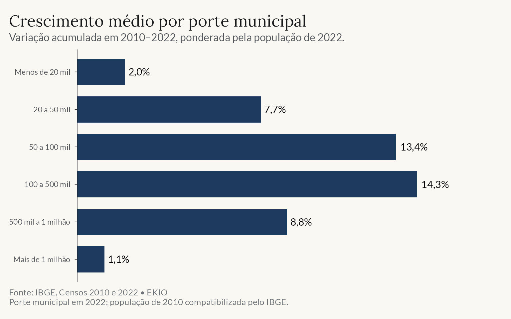

<!-- ============ Hero ============ -->
::: {.home-cover .column-screen}
```{=html}

```

::: {.home-cover-content}
::: {.home-cover-label}
Consultoria em Economia e Dados
:::

# Economia e dados aplicados a mercados, cidades e real estate. {.home-cover-title}

[Conheça nossos serviços](servicos.qmd){.home-cover-link}
:::
:::

::: {.home-intro}
Atendemos empresas e entidades governamentais em questões de mercado, investimento e localização.

[Fale conosco](mailto:contact@ekio.io?subject=Consulta%20inicial%20-%20EKIO){.link-rule}
:::

<!-- ============ O que fazemos ============ -->
::: {.band .band-light #services}
::: {.container}

::: {.section-head-row}
## O que fazemos {.section-heading}

[Ver todos os serviços](servicos.qmd){.link-rule-sm}
:::

::: {.services-grid}

::: {.service-card}
[01]{.service-num}

### Imóveis e inteligência espacial {.service-title}

[Avaliação imobiliária, geomarketing, seleção de pontos e análise de mercado com GIS e econometria espacial.]{.service-desc}

[Saiba mais](servicos.qmd#spatial){.service-link}
:::

::: {.service-card}
[02]{.service-num}

### Economia e estratégia {.service-title}

[Dimensionamento de mercado, previsão econômica e business cases.]{.service-desc}

[Saiba mais](servicos.qmd#economics){.service-link}
:::

::: {.service-card}
[03]{.service-num}

### Dados e analytics {.service-title}

[Do Excel a relatórios automatizados, dashboards interativos e modelos preditivos.]{.service-desc}

[Saiba mais](servicos.qmd#datascience){.service-link}
:::

:::
:::
:::

<!-- ============ Insight em destaque ============ -->
::: {.band .band-dark}
::: {.container}
::: {.featured-insight}

::: {.featured-chart}
{fig-alt="Gráfico de barras do crescimento populacional acumulado entre 2010 e 2022 por porte municipal; as cidades de 100 a 500 mil habitantes lideram, com 14,3%, e as de mais de um milhão crescem 1,1%."}
:::

::: {.featured-text}

[Insight em destaque]{.section-label .section-label-light}

## O crescimento das regiões metropolitanas brasileiras {.section-heading .section-heading-light}

[Entre 2010 e 2022, grandes metrópoles perderam população ou cresceram pouco, enquanto as cidades médias absorveram o crescimento. É a mesma leitura demográfica que aplicamos em dimensionamento de mercado e seleção de pontos.]{.featured-desc}

[Ler a análise completa](insights/posts/2025-06-censo-metro-regions/index.qmd){.link-rule-light}

:::

:::
:::
:::

<!-- ============ Publicações recentes ============ -->
::: {.band .band-light}
::: {.container}

::: {.section-head-row}
## Publicações recentes {.section-heading}

[Ver todos os insights](insights/index.qmd){.link-rule-sm}
:::

::: {#home-insights}
:::

:::
:::

<!-- ============ CTA ============ -->
::: {.band .band-cta .band-cta-art style="background-image: url(/static/images/art/hokusai-series-2026-09/hero-metropolitan-geometry.webp);"}
::: {.container}
::: {.cta-row}

::: {.cta-text}
## Comece por uma conversa {.cta-heading}

[Entrar em um novo mercado, avaliar um investimento ou montar uma estratégia de dados. Conte o seu caso e desenhamos a abordagem.]{.cta-desc}
:::

::: {.cta-actions}
[contact@ekio.io](mailto:contact@ekio.io?subject=Consulta%20inicial%20-%20EKIO){.link-rule-light}
[Formulário de contato](contato.qmd){.link-rule-light}
:::

:::
:::
:::
