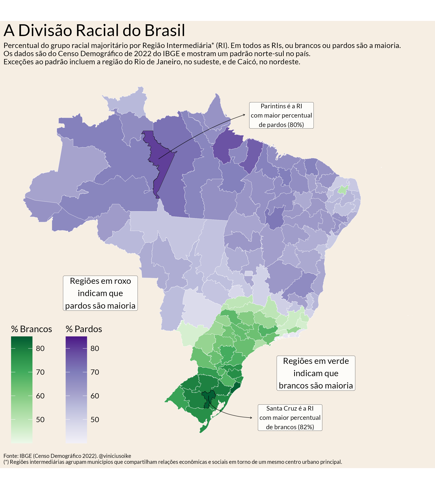

A distribuição racial do Brasil apresenta um contraste regional claro. A
população parda forma o maior grupo em quase todas as regiões intermediárias do
Norte e em grande parte do Nordeste e do Centro-Oeste. A população branca
predomina no Sul e em parte do Sudeste. As regiões do Rio de Janeiro e de Caicó,
no Rio Grande do Norte, estão entre as exceções a esse padrão norte-sul.

O mapa usa os dados de cor ou raça do Censo Demográfico de 2022. No total do
país, 45,3% da população se declarou parda e 43,5%, branca. Pessoas pretas
representavam 10,2% da população; indígenas, 0,6%; e amarelas, 0,4%. Apesar da
diversidade nacional, apenas pessoas pardas ou brancas formavam o maior grupo em
cada região intermediária.

[{fig-align="center" fig-alt="Mapa do Brasil por região geográfica intermediária. Tons de roxo indicam regiões em que pessoas pardas formam o maior grupo racial; tons de verde indicam regiões em que pessoas brancas formam o maior grupo. O roxo predomina no Norte, no Nordeste e no Centro-Oeste, enquanto o verde se concentra no Sul e em parte do Sudeste."}](censo_mapa_raca.png)

As regiões geográficas intermediárias agrupam regiões imediatas articuladas por
um mesmo centro urbano. Essa divisão reduz o ruído que apareceria em um mapa
municipal e mantém diferenças importantes dentro de cada estado. A intensidade
da cor representa a participação do grupo predominante, não a composição racial
completa da região.

O contraste aparece com maior força nos extremos. A região intermediária de
Parintins, no Amazonas, tinha a maior proporção de pessoas pardas, com 80%. A
região de Santa Cruz do Sul–Lajeado, no Rio Grande do Sul, registrava a maior
proporção de pessoas brancas, com 82%.

Fonte: IBGE, Censo Demográfico 2022.
