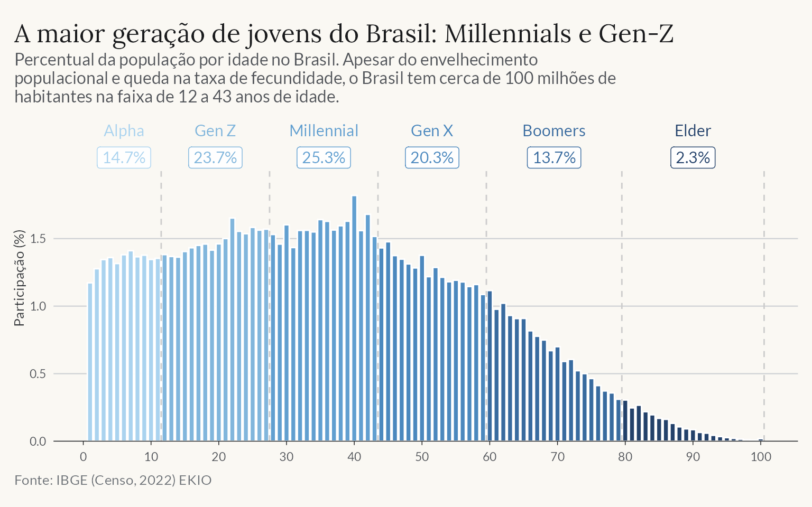
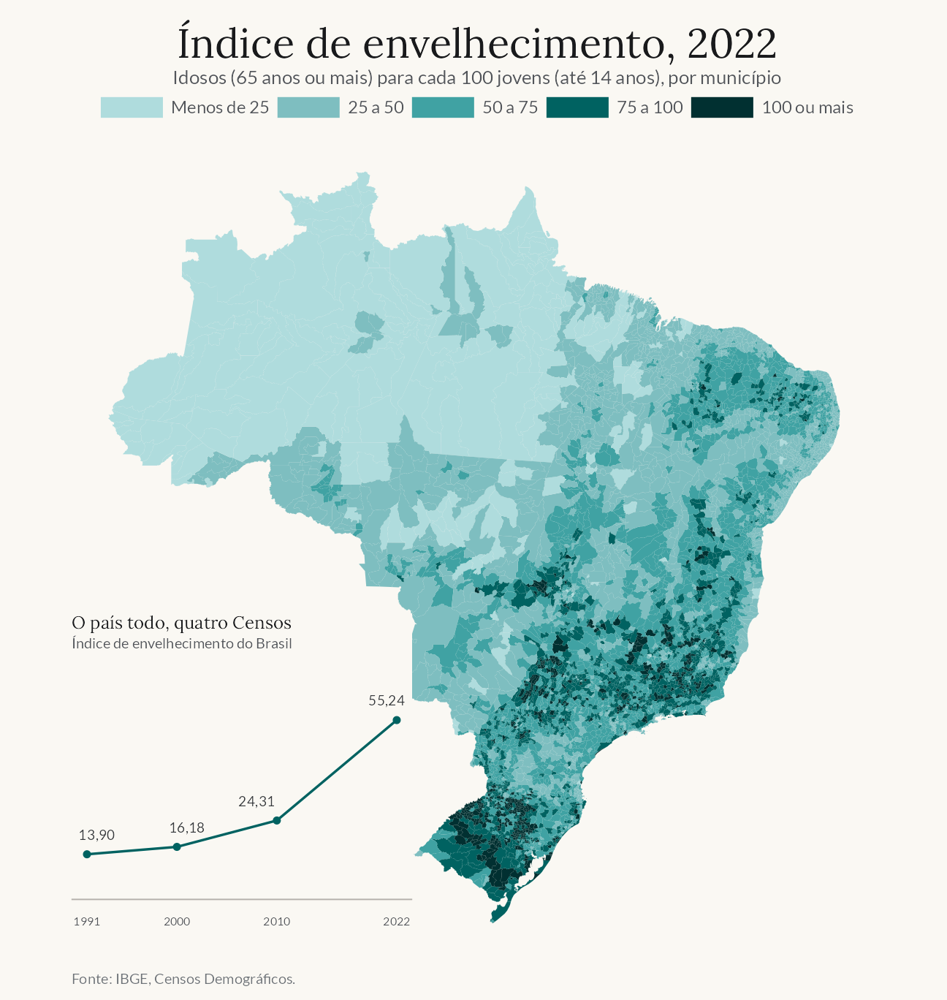

```{r setup}
library(biscale)
library(dplyr)
library(ggplot2)
library(gt)
library(patchwork)
library(sf)
library(stringr)
library(tidyr)

source(here::here("insights/posts/_ekio-style.R"))

demography <- readr::read_rds(here::here(
  "insights/posts/2025-07-demografia-brasil/demografia_brasil.rds"
))
state_dependency <- demography$state_dependency
population_pyramid <- demography$population_pyramid
projections <- demography$projections

ek_caption_censo2022 <- "Fonte: IBGE (Censo Demográfico 2022) • EKIO"
source_ibge <- "Fonte: IBGE (Censo Demográfico 2022, Projeções da População rev. 2024) • EKIO"
```

```{r indicators}
brazil_dependency <- projections |>
  filter(
    geography == "Brasil",
    variable == "Razão de dependência total"
  )

minimum_dependency <- brazil_dependency |>
  slice_min(value, n = 1, with_ties = FALSE)

dependency_2025 <- brazil_dependency |>
  filter(year == 2025) |>
  pull(value)

dependency_2050 <- brazil_dependency |>
  filter(year == 2050) |>
  pull(value)

crossover <- projections |>
  filter(
    variable %in%
      c(
        "Razão de dependência de jovens",
        "Razão de dependência de idosos"
      )
  ) |>
  select(geography, year, variable, value) |>
  pivot_wider(names_from = variable, values_from = value) |>
  filter(
    `Razão de dependência de idosos` >= `Razão de dependência de jovens`
  ) |>
  summarise(year = min(year), .by = geography)

crossover_brazil <- crossover |>
  filter(geography == "Brasil") |>
  pull(year)
```

O Brasil ainda tem uma grande população em idade de trabalhar, mas a
composição etária do país já mudou de direção. A razão de dependência
total atingiu seu menor valor em `r minimum_dependency$year`, com cerca de
`r format(round(minimum_dependency$value, 1), decimal.mark = ",")` jovens e
idosos para cada 100 pessoas de 15 a 64 anos. Em 2025, a projeção do IBGE
colocava essa razão em `r format(round(dependency_2025, 1), decimal.mark = ",")`.
A diferença ainda é pequena, mas marca o fim da longa queda que caracterizou o
bônus demográfico brasileiro.

::: column-margin
**Bônus demográfico** <br> A expressão descreve o período em que a população
em idade de trabalhar cresce mais rápido do que os grupos dependentes. É uma
janela de estrutura etária, não uma promessa de crescimento.
:::

Essa inflexão não equivale a uma ruptura. O bônus demográfico descreve uma
janela em que a população potencialmente ativa cresce em relação aos grupos
dependentes; ele não mede emprego, produtividade ou renda. O Brasil pode colher
benefícios dessa estrutura por algum tempo, desde que consiga incorporar mais
pessoas ao mercado de trabalho e elevar sua produtividade. A janela, porém, se
estreitou e deixará de favorecer o crescimento de forma automática.

## Quatro sinais da transição

- A fecundidade caiu de 6,28 filhos por mulher em 1960 para 1,55 em 2022,
  segundo o [Censo Demográfico](https://educa.ibge.gov.br/jovens/materias-especiais/22718-taxa-de-fecundidade-do-pais-caiu-para-1-55-filho-por-mulher-de-acordo-com-o-censo-2022.html).
- Quase metade da população tinha entre 12 e 43 anos em 2022. Geração Z e
  Millennials somavam perto de 100 milhões de pessoas, o maior contingente jovem
  da história brasileira.
- O índice de envelhecimento subiu de 13,9 idosos para cada 100 jovens em 1991
  para 55,2 em 2022.
- A dependência idosa deve superar a dependência jovem por volta de
  `r crossover_brazil`, segundo a revisão de 2024 das projeções do IBGE.

Os quatro movimentos fazem parte do mesmo processo. A queda da fecundidade
reduz primeiro o número relativo de crianças e abre a janela demográfica. Mais
tarde, as coortes numerosas envelhecem e elevam a proporção de idosos. O país
passa, então, de uma estrutura com muitos jovens para outra em que a longevidade
tem peso crescente.

::: column-margin
**Definindo gerações** <br> As faixas seguem a definição do Beresford Research:
Millennials nasceram entre 1981 e 1996, e a Geração Z entre 1997 e 2012.
:::

::: column-page-right
:::::: grid
::: {.g-col-12 .g-col-lg-4}
A concentração de adultos jovens ainda oferece uma base ampla para o mercado
de trabalho e para a demanda por moradia.

Ao mesmo tempo, a base da pirâmide etária se estreita. Haverá menos pessoas
entrando na vida adulta nas próximas décadas, enquanto as gerações hoje
numerosas avançarão para idades em que a demanda por saúde, cuidado e
acessibilidade aumenta.
:::

::: {.g-col-12 .g-col-lg-8}
{width="100%" fig-alt="Gráfico de colunas da participação de cada idade na população brasileira, com cores por geração. Geração Z e Millennials concentram 49% da população."}
:::
:::::::
:::

O envelhecimento já aparece em todo o território, mas sua intensidade varia. O
Sul e o Sudeste concentram os municípios com maior proporção de idosos em
relação aos jovens. O Norte permanece mais jovem, e o Nordeste combina
municípios em estágios diferentes da transição.

::: column-margin
**Índice de envelhecimento** <br> Razão entre a população de 65 anos ou mais e a
população de 0 a 14 anos, multiplicada por 100. Valores acima de 100 indicam
mais idosos do que jovens no município.
:::

Essa diversidade limita diagnósticos nacionais muito simples: o desafio de cada
região depende tanto do nível atual quanto da velocidade da mudança.

::: column-page-right
{width="100%" fig-alt="Mapa do índice de envelhecimento dos municípios brasileiros em 2022. As cores representam idosos por 100 jovens. Os maiores valores se concentram no Sul e no Sudeste; o Norte apresenta uma população mais jovem."}
:::

## A razão de dependência voltou a subir

A razão de dependência compara a população em idades potencialmente inativas
com a população em idade potencialmente ativa. O denominador inclui todas as
pessoas de 15 a 64 anos, não apenas quem participa da população economicamente
ativa. Por isso, o indicador descreve uma estrutura etária e não a dependência
econômica efetiva de cada domicílio.

::: column-margin
**As três razões** <br> A razão de dependência total (RDT) soma os dois
componentes:

$$
\begin{aligned}
\text{RDJ} &= 100 \times \frac{P_{0–14}}{P_{15–64}} \\[4pt]
\text{RDI} &= 100 \times \frac{P_{65+}}{P_{15–64}} \\[4pt]
\text{RDT} &= \text{RDJ} + \text{RDI}
\end{aligned}
$$

$P_{0–14}$ é a população de 0 a 14 anos, $P_{15–64}$ a população de 15 a 64
anos e $P_{65+}$ a população de 65 anos ou mais.
:::

Durante a primeira fase da transição, a queda da dependência jovem foi maior
do que o aumento da dependência idosa. Esse movimento reduziu a RDT brasileira
de 56,3 em 2000 para aproximadamente 44 no fim da década de 2010. A partir daí,
o envelhecimento passou a dominar a conta. A projeção chega a
`r format(round(dependency_2050, 1), decimal.mark = ",")` dependentes para cada
100 pessoas em idade potencialmente ativa em 2050.

```{r dependency-projection}
#| column: page-right
#| fig-alt: "Séries da dependência jovem, idosa e total entre 2000 e 2060 para o Brasil e as cinco grandes regiões. A dependência jovem cai, enquanto a idosa cresce em todas as regiões."
#| out-width: "100%"
#| fig-width: 12
#| fig-height: 6
projection_plot <- projections |>
  filter(variable != "Índice de envelhecimento") |>
  mutate(
    indicator = recode(
      variable,
      "Razão de dependência de idosos" = "RDI",
      "Razão de dependência de jovens" = "RDJ",
      "Razão de dependência total" = "RDT"
    ),
    geography = factor(
      geography,
      levels = c(
        "Brasil",
        "Norte",
        "Nordeste",
        "Sudeste",
        "Sul",
        "Centro-Oeste"
      )
    )
  )

dependency_colors <- c(
  "RDI" = ekio_site$orange,
  "RDJ" = ekio_site$teal,
  "RDT" = ekio_site$navy
)

ggplot(projection_plot, aes(year, value, color = indicator)) +
  annotate(
    "rect",
    xmin = 2022.5,
    xmax = Inf,
    ymin = -Inf,
    ymax = Inf,
    fill = ekio_site$navy_tint,
    alpha = 0.35
  ) +
  geom_line(linewidth = 0.8) +
  facet_wrap(vars(geography), ncol = 3) +
  scale_x_continuous(breaks = seq(2000, 2060, 20)) +
  scale_y_continuous(limits = c(0, 75), breaks = seq(0, 75, 15)) +
  scale_color_manual(name = NULL, values = dependency_colors) +
  labs(
    title = "A dependência idosa muda a trajetória",
    subtitle = "Razões de dependência por grande região; a área azul indica o período projetado",
    x = NULL,
    y = "Dependentes por 100 pessoas de 15 a 64 anos",
    caption = source_ibge
  ) +
  theme_ekio_site(grid = "y") +
  theme(
    legend.position = "top",
    strip.text = element_text(size = 11),
    panel.spacing = unit(1, "lines")
  )
```

O Sul e o Sudeste estão mais próximos do ponto em que a RDI supera a RDJ. Nas
projeções, o cruzamento ocorre em 2033 no Sul e em 2034 no Sudeste. O Nordeste
e o Centro-Oeste chegam a esse ponto na década de 2040, enquanto o Norte só o
alcança em 2056. Apesar da diferença de calendário, todas as regiões devem ter
RDT superior a 50 em 2050.

```{r dependency-table}
dependency_table <- projections |>
  filter(
    variable == "Razão de dependência total",
    year %in% c(2020, 2030, 2040, 2050, 2060)
  ) |>
  select(geography, year, value) |>
  pivot_wider(names_from = year, values_from = value) |>
  mutate(
    geography = factor(
      geography,
      levels = c(
        "Brasil",
        "Norte",
        "Nordeste",
        "Sudeste",
        "Sul",
        "Centro-Oeste"
      )
    )
  ) |>
  arrange(geography)

dependency_table |>
  gt() |>
  cols_label(geography = "Brasil e regiões") |>
  fmt_number(-geography, decimals = 1, dec_mark = ",") |>
  tab_header(
    title = "A razão de dependência volta a crescer",
    subtitle = "Jovens e idosos para cada 100 pessoas de 15 a 64 anos"
  ) |>
  tab_source_note(source_ibge) |>
  gt_theme_hokusai(stripe = TRUE)
```

## Três perfis regionais

Os estados brasileiros formam três grupos amplos. O Norte combina alta
dependência jovem e baixa dependência idosa. O Sul e parte do Sudeste exibem o
padrão oposto, com maior peso dos idosos. Nordeste e Centro-Oeste ocupam
posições intermediárias e mais heterogêneas.

::: column-page-right
:::::: grid
::: {.g-col-12 .g-col-lg-5}
O Rio Grande do Sul tem a maior dependência idosa do país: 20,6 idosos para
cada 100 pessoas de 15 a 64 anos. Amazonas e Roraima ainda estão no outro
extremo, com estruturas mais jovens.

Santa Catarina chama atenção dentro do Sul porque a entrada de adultos em idade
de trabalhar reduz sua dependência total, embora o estado também envelheça.
:::

::: {.g-col-12 .g-col-lg-7}
```{r dependency-map}
#| fig-alt: "Mapa bivariado das razões de dependência jovem e idosa nas unidades da federação em 2022. Estados do Norte têm maior dependência jovem; Rio Grande do Sul e Rio de Janeiro têm maior dependência idosa."
#| out-width: "100%"
#| fig-width: 7
#| fig-height: 6
dependency_classes <- bi_class(
  state_dependency,
  x = rdi,
  y = rdj,
  style = "quantile",
  dim = 3
)

map_states <- ggplot(dependency_classes) +
  geom_sf(aes(fill = bi_class), color = ekio_site$paper, linewidth = 0.35) +
  bi_scale_fill(pal = "GrPink", dim = 3) +
  guides(fill = "none") +
  coord_sf(datum = NA) +
  labs(
    title = "A transição tem ritmos regionais",
    subtitle = "Combinação das razões de dependência jovem e idosa por UF, 2022",
    caption = ek_caption_censo2022
  ) +
  theme_ekio_site() +
  theme(
    axis.text = element_blank(),
    axis.title = element_blank(),
    axis.ticks = element_blank(),
    panel.grid = element_blank()
  )

map_legend <- bi_legend(
  pal = "GrPink",
  dim = 3,
  xlab = "Dependência idosa",
  ylab = "Dependência jovem",
  size = 8
)

map_states + inset_element(map_legend, 0.02, 0.08, 0.34, 0.42)
```
:::
:::::::
:::

::: column-page-right
:::::: grid
::: {.g-col-12 .g-col-lg-4}
As pirâmides etárias mostram essas diferenças sem resumir a população em um
único indicador. Amazonas tem base larga e maior participação de crianças.

No Rio Grande do Sul, as coortes mais numerosas estão em idades mais avançadas.
O Piauí representa uma estrutura em transição, enquanto Santa Catarina concentra
uma parcela maior da população nas idades adultas.
:::

::: {.g-col-12 .g-col-lg-8}
```{r population-pyramids}
#| fig-alt: "Pirâmides etárias de Amazonas, Piauí, Santa Catarina e Rio Grande do Sul. Amazonas tem base mais larga e o Rio Grande do Sul concentra mais população nas faixas de maior idade."
#| out-width: "100%"
#| fig-width: 8
#| fig-height: 7
pyramid_colors <- c(
  "Homens" = ekio_site$teal,
  "Mulheres" = ekio_site$purple
)

pyramid_breaks <- seq(-6, 6, 2)

ggplot(
  population_pyramid,
  aes(age_group, share, fill = sex)
) +
  geom_col(width = 0.8) +
  geom_hline(yintercept = 0, color = ekio_site$rule_strong) +
  coord_flip() +
  facet_wrap(vars(name_state), ncol = 2) +
  scale_y_continuous(
    breaks = pyramid_breaks,
    labels = abs(pyramid_breaks)
  ) +
  scale_fill_manual(name = NULL, values = pyramid_colors) +
  labs(
    title = "Quatro estruturas etárias",
    subtitle = "Participação de cada faixa etária na população estadual, 2022",
    x = NULL,
    y = "Participação na população (%)",
    caption = ek_caption_censo2022
  ) +
  theme_ekio_site(grid = "x") +
  theme(
    legend.position = "top",
    strip.text = element_text(size = 11),
    panel.spacing = unit(1, "lines")
  )
```
:::
:::::::
:::

::: column-margin
**Lendo a pirâmide** <br> Cada barra mostra a participação da faixa etária na
população do estado. Homens aparecem à esquerda
([teal]{style="color:#006261"}) e mulheres à direita
([roxo]{style="color:#8A5CA1"}).
:::

## O que muda com o envelhecimento

A transição demográfica altera a demanda por serviços e a disponibilidade de
trabalhadores. Saúde e cuidado de longa duração ganham peso, enquanto escolas e
serviços voltados à infância precisam se ajustar a coortes menores. No mercado
de trabalho, o crescimento dependerá mais da produtividade, da participação e
da permanência de adultos mais velhos. O efeito fiscal também aparece na
combinação entre previdência, saúde e uma base de contribuintes que cresce
menos.

As cidades sentirão parte importante dessa mudança. Uma população mais velha
demanda calçadas acessíveis, transporte público próximo, moradias adaptáveis e
serviços distribuídos pelo território. Como os mapas mostram, o ritmo não será
uniforme: alguns lugares precisam responder agora, enquanto outros ainda têm
uma população jovem e forte demanda por educação e entrada no mercado de
trabalho. Políticas nacionais terão de acomodar essas duas realidades.

O Brasil atravessa, portanto, uma transição previsível, mas desigual. O ponto
de menor dependência ficou para trás, embora a população em idade de trabalhar
ainda seja numerosa. Aproveitar essa estrutura e preparar serviços, cidades e
instituições para o envelhecimento são partes do mesmo desafio.

## Leituras relacionadas

- [Onde o Brasil já envelheceu](../2025-09-envelhecimento-brasil/index.qmd)
- [Gerações no Brasil](../2025-02-generations-brazil/index.qmd)

Dados: [IBGE, Censo Demográfico 2022](https://www.ibge.gov.br/estatisticas/sociais/populacao/22827-censo-demografico-2022.html)
e [Projeções da População, revisão 2024](https://www.ibge.gov.br/estatisticas/sociais/populacao/9109-projecao-da-populacao.html).


