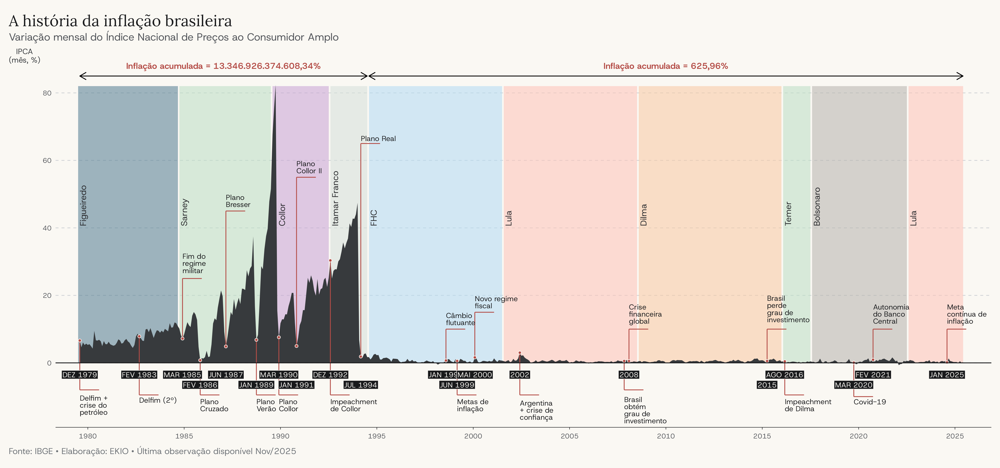
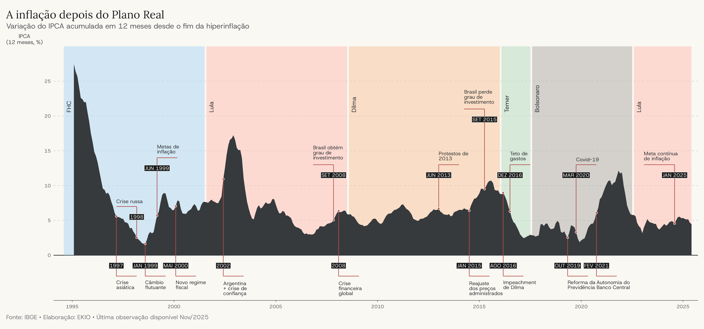

O Brasil tem uma relação longa e dolorosa com a inflação. Embora os critérios
mais usuais classifiquem apenas um breve intervalo do início dos anos 1990 como
[hiperinflação](https://pt.wikipedia.org/wiki/Hiperinfla%C3%A7%C3%A3o_no_Brasil),
poucos países enfrentaram por tanto tempo uma alta de preços tão persistente. O
primeiro gráfico apresenta a variação mensal do Índice Nacional de Preços ao
Consumidor Amplo (IPCA) e destaca eventos econômicos e institucionais importantes.
As cores ao fundo identificam os ocupantes da Presidência da República; João
Figueiredo aparece como o último presidente do regime militar, e não como um
presidente eleito pelo voto direto.

A visualização foi inspirada no livro
[*Saga brasileira: a longa luta de um povo por sua moeda*](https://www.amazon.com.br/Saga-brasileira-longa-luta-moeda/dp/8501088714),
de Miriam Leitão. A inflação acumulada no período anterior ao Plano Real superou
13 trilhões por cento. Em julho de 1994, o novo plano estabilizou a economia e
encerrou décadas de inflação elevada. A mudança foi profunda, mas não tornou o
país imune à alta de preços: entre janeiro de 1995 e novembro de 2025, a
inflação acumulada chegou a 626%.

O gráfico não mostra com a mesma clareza a sucessão de moedas que marcou esse
período. Quase todo plano econômico trouxe uma troca de moeda ou algum tipo de
congelamento de preços e salários. As quedas abruptas da série coincidem com
esses episódios: a inflação parecia ceder por um tempo e logo voltava com
força.

Até 1986, o país usava o cruzeiro, que passou por diversas reformas para
acomodar a inflação. O Plano Cruzado introduziu o cruzado; em 1989, o Plano
Verão criou o cruzado novo. O Plano Collor retomou o nome cruzeiro em 1990. Na
transição para o real, o cruzeiro virou cruzeiro real e o governo criou a
Unidade Real de Valor (URV), uma unidade de conta que antecedeu a nova moeda.

::: {.column-screen-inset}
[{fig-align="center" fig-alt="Gráfico da variação mensal do IPCA entre 1980 e novembro de 2025, com inflação muito elevada até o Plano Real e taxas menores depois de 1994"}](inflation_historic.png)
:::

## Depois do Plano Real

A estabilização de 1994 não reduziu a inflação imediatamente aos níveis que
prevaleceriam nos anos seguintes. O segundo gráfico concentra a análise no
período posterior ao Plano Real e apresenta a variação do IPCA acumulada em 12
meses. A série começa em julho de 1995 para evitar que as taxas anteriores à
estabilização contaminem a comparação.

::: {.column-screen-inset}
[{fig-align="center" fig-alt="Gráfico da inflação acumulada em 12 meses de 1995 a novembro de 2025, com queda após o Plano Real e picos em 2002, 2015 e 2022"}](inflation_historic_post_real.png)
:::

O IPCA caiu de forma contínua nos primeiros anos do Plano Real e chegou ao fim
da década de 1990 no menor patamar em muitos anos. As crises que começaram na
Ásia e se espalharam por outras economias emergentes pressionaram o regime
cambial brasileiro. Em 1999, o Banco Central deixou o câmbio flutuar e adotou o
regime de metas de inflação. No ano seguinte, a Lei de Responsabilidade Fiscal
estabeleceu novas regras para a gestão das finanças públicas.

Nos anos 2000, a inflação permaneceu acima do centro da meta em boa parte do
tempo, apesar dos juros elevados e dos superávits primários. Ao mesmo tempo, o
boom das commodities ampliou os superávits comerciais, enquanto a estabilidade
macroeconômica e o fortalecimento institucional atraíram investimento externo.
O país também atravessou a crise financeira de 2008 com uma queda relativamente
breve da atividade econômica.

Na década seguinte, a inflação voltou a ganhar força. Diante da desaceleração
da economia, o governo ampliou os gastos, reduziu os juros e criou linhas de
crédito subsidiado e desonerações tributárias. Também conteve preços
administrados, como os de energia elétrica, combustíveis e transporte público.
O reajuste desses preços em 2015 elevou a inflação e agravou a deterioração do
cenário macroeconômico. Em agosto de 2016, o Senado aprovou o impeachment de
Dilma Rousseff, e o vice-presidente Michel Temer assumiu a Presidência.

A inflação recuou nos anos seguintes, período em que o Congresso aprovou o teto
de gastos e a reforma da Previdência. A autonomia formal do Banco Central entrou
em vigor em 2021. Depois do choque inflacionário associado à pandemia de
Covid-19, a autoridade monetária elevou fortemente a taxa básica de juros. Em
agosto de 2023, com a inflação em queda, o Banco Central iniciou um novo ciclo de
redução da Selic. Em janeiro de 2025, o país passou a adotar uma meta contínua
de inflação, avaliada a cada mês com base no IPCA acumulado em 12 meses.


