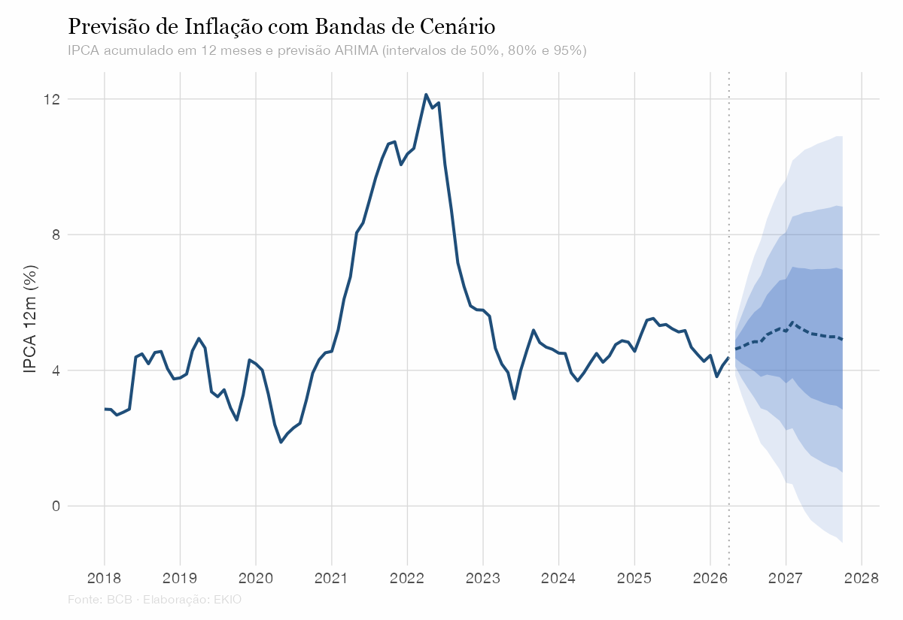
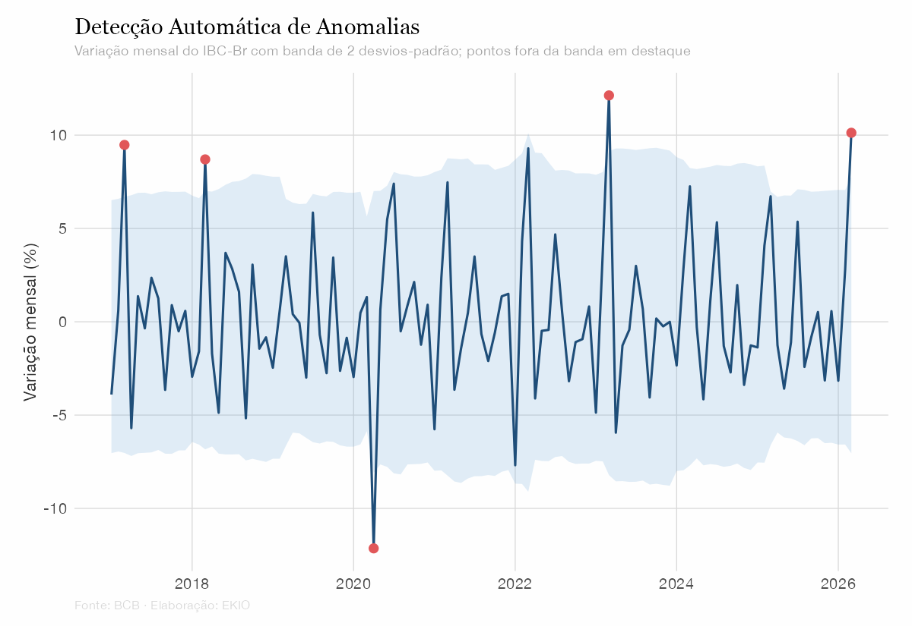

::: {.page-header}
::: {.container}

::: {.page-header-main}
[Expertise]{.section-label}

# Serviços {.page-header-title}
:::

::: {.page-header-aside}
[A EKIO combina economia, ciência de dados e inteligência espacial para ajudar empresas e governos a tomar decisões melhores. O trabalho de maior impacto acontece na interseção dessas disciplinas.]{.page-header-desc}
:::

:::
:::

<!-- ============ Detalhamento dos serviços ============ -->
::: {.band .band-light .band-flush}
::: {.container}

::: {.service-detail #spatial}

[01]{.service-detail-num}

::: {.service-detail-body}
## Imóveis & Inteligência Espacial {.service-detail-title}

[Localização é uma das variáveis mais poderosas nos negócios — mas frequentemente a menos rigorosamente analisada. A EKIO combina GIS, econometria espacial e modelagem demográfica para responder às perguntas "onde": onde investir, onde construir, onde expandir e como a geografia influencia o valor.]{.service-detail-desc}

::: {.service-offerings}
- Avaliação Imobiliária & Modelos de Preços Hedônicos [4–8 semanas]{.offering-timeline}
- Análise de Mercado Imobiliário & Viabilidade [6–10 semanas]{.offering-timeline}
- Seleção de Sites & Inteligência Locacional [3–6 semanas]{.offering-timeline}
- Geomarketing & Estudos de Área de Influência [3–6 semanas]{.offering-timeline}
- Economia Urbana & Análise de Uso do Solo [8–16 semanas]{.offering-timeline}
:::

::: {.methodology-tags}
[GIS / QGIS]{.method-tag}
[Preços Hedônicos]{.method-tag}
[Regressão Espacial]{.method-tag}
[Modelagem Demográfica]{.method-tag}
:::
:::

::: {.service-detail-visual}

:::

:::

::: {.service-detail #economics}

[02]{.service-detail-num}

::: {.service-detail-body}
## Economia & Estratégia {.service-detail-title}

[Análise econômica rigorosa para tomada de decisões estratégicas. Do dimensionamento de mercado aos estudos de viabilidade, métodos econométricos e análise de cenários quantificam incertezas, avaliam riscos e constroem a base de evidências para decisões de alto impacto.]{.service-detail-desc}

::: {.service-offerings}
- Dimensionamento de Mercado & Previsão de Demanda [4–8 semanas]{.offering-timeline}
- Business Case & Estudos de Viabilidade [6–10 semanas]{.offering-timeline}
:::

::: {.methodology-tags}
[Econometria]{.method-tag}
[Análise de Cenários]{.method-tag}
[VPL / TIR]{.method-tag}
:::
:::

::: {.service-detail-visual}

:::

:::

::: {.service-detail #datascience}

[03]{.service-detail-num}

::: {.service-detail-body}
## Dados & Analytics {.service-detail-title}

[De planilhas a inteligência acionável. A EKIO ajuda empresas presas em rotinas manuais de Excel a modernizar seus fluxos de análise: relatórios manuais viram pipelines reproduzíveis, planilhas viram dashboards interativos e as decisões passam a ser sustentadas por modelos estatísticos sólidos.]{.service-detail-desc}

::: {.service-offerings}
- Modernização de Fluxos Analíticos — do Excel a relatórios automatizados [3–8 semanas]{.offering-timeline}
- Dashboards & Visualização de Dados [4–8 semanas]{.offering-timeline}
- Modelagem Preditiva & Machine Learning [6–12 semanas]{.offering-timeline}
- Análise Estatística & Testes de Hipóteses [2–6 semanas]{.offering-timeline}
:::

::: {.methodology-tags}
[R / Python]{.method-tag}
[Quarto / Shiny]{.method-tag}
[Modelagem Estatística]{.method-tag}
[Machine Learning]{.method-tag}
[Detecção de Anomalias]{.method-tag}
[BI & Visualização]{.method-tag}
:::
:::

::: {.service-detail-visual}

:::

:::

:::
:::

<!-- ============ Processo ============ -->
::: {.band .band-light}
::: {.container}

[Processo]{.section-label}

## Como funciona cada engajamento {.section-heading}

::: {.process-grid}

::: {.process-step}
[01]{.process-number}

### Escopo {.process-title}

Definimos juntos a pergunta, as necessidades de dados e os critérios de sucesso. Consulta inicial gratuita.
:::

::: {.process-step}
[02]{.process-number}

### Análise {.process-title}

Metodologia rigorosa — a ferramenta certa para a pergunta certa, com check-ins regulares.
:::

::: {.process-step}
[03]{.process-number}

### Entrega {.process-title}

Narrativas claras, visualizações acionáveis e código reprodutível — não relatórios para gaveta.
:::

::: {.process-step}
[04]{.process-number}

### Suporte {.process-title}

Suporte contínuo, opções de retainer e transferência de conhecimento para sua equipe.
:::

:::
:::
:::

<!-- ============ CTA ============ -->
::: {.band .band-cta}
::: {.container}
::: {.cta-row}

::: {.cta-text}
## Vamos discutir o seu projeto {.cta-heading}

[A consulta inicial é gratuita. Conte sobre o seu desafio e receba uma sugestão de abordagem sob medida.]{.cta-desc}
:::

::: {.cta-actions}
[contact@ekio.io](mailto:contact@ekio.io?subject=Projeto%20-%20Servicos%20EKIO){.link-rule-light}
[Formulário de contato](contato.qmd){.link-rule-light}
:::

:::
:::
:::
