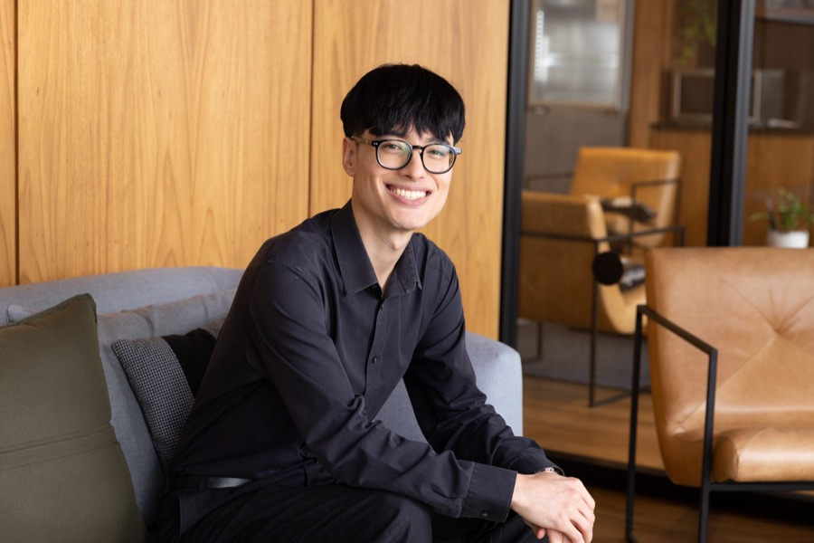

::: {.page-header}
::: {.container}

::: {.page-header-main}
[Quem somos]{.section-label}

# Sobre a EKIO {.page-header-title}
:::

:::
:::

::: {.art-strip .art-strip-sm style="background-image: url(/static/images/art/faixa-estaiada.webp);" role="img" aria-label="Colagem editorial da Ponte Estaiada com a malha viária e uma mancha de densidade"}
:::

<!-- ============ Fundador ============ -->
::: {.band .band-light}
::: {.container}
::: {.about-grid}

::: {.about-media}
{.about-photo fig-alt="Retrato em preto e branco de Vinicius Oike Reginatto, sentado, de óculos."}
:::

::: {.about-body}

::: {.label-ruled}
[Fundador]{}
:::

## Vinicius Oike Reginatto {.about-name}

[Fundador & Consultor Principal]{.about-role}

[Fundei a EKIO para trabalhar na interseção entre economia, ciência de dados e análise espacial, um cruzamento que o mercado brasileiro raramente cobre.]{.about-bio}

[Começo todo projeto entendendo o problema antes de escolher a ferramenta. Faço perguntas difíceis antes de escrever a primeira linha de código.]{.about-bio}

[Os resultados vão para uma sala de diretoria ou para uma equipe de planejamento municipal, e o formato muda conforme o público.]{.about-bio}

::: {.credentials-grid}

::: {.credential}
[Formação]{.credential-label}

[Mestrado em Economia, USP]{.credential-value}
:::

::: {.credential}
[Experiência]{.credential-label}

[Mais de 8 anos em consultoria]{.credential-value}
:::

::: {.credential}
[Especializações]{.credential-label}

[Econometria, análise espacial, ciência de dados]{.credential-value}
:::

::: {.credential}
[Localização]{.credential-label}

[São Paulo, Brasil]{.credential-value}
:::

:::
:::

:::
:::
:::

<!-- ============ CTA ============ -->
::: {.band .band-cta .band-cta-art style="background-image: url(/static/images/art/fundo-cta-skyline.webp);"}
::: {.container}
::: {.cta-row}

::: {.cta-text}
## Vamos trabalhar juntos {.cta-heading}

[O primeiro passo é sempre uma conversa sobre o problema, antes de qualquer proposta.]{.cta-desc}
:::

::: {.cta-actions}
[contact@ekio.io](mailto:contact@ekio.io?subject=Contato%20-%20EKIO){.link-rule-light}
[Formulário de contato](contato.qmd){.link-rule-light}
:::

:::
:::
:::
